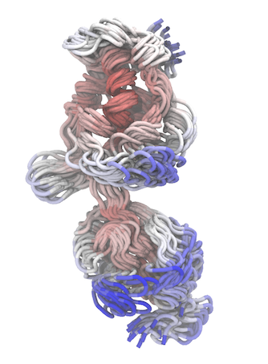

# ENM_BD
Brownian Dynamics (BD) with Elastic Network Models (ENMs) for sampling of protein conformational dynamics

You can use the "ENM_BD.f90" (source code in Fortran) to run BD and sample new protein conformations from an input PDB structure, which you can compared e.g. to MD or NMR ensembles. Reference: [INSERT BIORXIV PREPRINT LINK]

First compile the code with: gfortran ENM_BD.f90 -o ENM.f90 -fopenmp (by default, we use 16 OpenMP threads. You can change this by modifying the "num_threads" parameter in the source code).

Then, simply run the code providing 4 inputs from the terminal with: ./ENM_BD $pdb_file $chain_IDs $tot_number_steps $save_frequency

Input 1 = name of the PDB file (with .pdb extension and standard PDB formatting. Note that only CA atoms with empty or "A" altLoc will be read); input 2 = chain identifiers (e.g., "A", "AB", "ABCD", etc.); input 3 = total number of steps of the simulation (note that dt = 2 fs, so if you want to run 1 ns, you have to type 500,000 steps); input 4 = number of steps after which the code saves conformation coordinates (if you want to save e.g. every ps, type 500). The folder RBP_example/BD_1ns_1000conformers reports BD conformations for RBP obtained from 1ba2.pdb using: ./ENM_BD 1ba2.pdb A 500000 500

We also provide here a modified version of our previous eBDIMS2 code (https://github.com/domenicoscaramozzino/eBDIMS2 ; https://www.nature.com/articles/s41467-026-69809-y), "eBDIMS2_mod.f90", which employs slightly different BD parameters and updated edENM parameters to improve the quality of generated conformations along transition paths.

Again, compile with: gfortran eBDIMS2_mod.f90 -o eBDIMS2_mod.f90 -fopenmp

Run with: ./eBDIMS2_mod $pdb_ref $chain_ID_ref $pdb_tar $chain_ID_tar $save_frequency $DIMS_convergence $max_numb_steps

Where, input 1 = name of PDB file of the starting structure; input 2 = chain ID(s) of the starting structure; input 3 and 4 = same for the target structure; input 5 = number of DIMS steps after which the code saves conformation coordinates (typical values are 100-1000); input 6 = convergence to the target to stop the simulation (typical values are 95%-99%); input 7 = total simulation steps (typical values are 1,000,000-10,000,000). More details in https://github.com/domenicoscaramozzino/eBDIMS2. The folder RBP_example contains eBDIMS2_mod transitions for RBP (both 1ba2 >> 2dri and 2dri >> 1ba2), generated using: "./eBDIMS2_mod 1ba2.pdb A 2dri.pdb A 100 99.0 1000000" and "./eBDIMS2_mod 2dri.pdb A 1ba2.pdb A 100 99.0 1000000"

